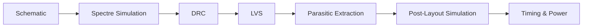

This is a tutorial on VLSI testing based on the course EECS 4321 mini processor project at Columbia University. For tutorials on layout, please refer to [VLSI Mini Processor](https://mg-04.github.io/articles/vlsi) by my teammate Ming Gong.

This tutorial covers everything you need to know to verify the **functionality** of your mini processor design through various Cadence tools. Hopefully, this tutorial will help you figure out bugs in your design in an efficient way and make you feel more confident about your final submission.

<!-- more -->

## Overview

The verification flow for the EECS 4321 mini processor follows this sequence:

Each stage is covered in a section below.

---

## 1. Spectre Simulation by Cadence ADE

The first step of the testing process is to set up a Spectre simulation testbench in Cadence ADE. This testbench will allow you to simulate your design and observe its behavior under some input conditions you define. Notice that under most circumstances, you will not be able to simulate the entire design through this method due to the complexity of the design. Instead, you will need to utilize the `.vec` files to make a comprehensive test of your design.

### 1.1 Setting up the Testbench

This part assumes that you have already finished the schematic part of your design. First, you will need to instantiate your schematic by using the "Cellview" option in Cadence Virtuoso.

<!-- TODO: add screenshot of ADE launch and cellview instantiation -->

### 1.2 Configuring Simulation Parameters

<!-- TODO: cover transient analysis setup, supply voltage, clock period, load conditions -->

### 1.3 Running the Simulation

<!-- TODO: explain how to launch the simulation and what to expect -->

### 1.4 Reading Waveforms in ADE

<!-- TODO: cover waveform viewer, how to probe signals, common signals to check (clock, output, intermediate nodes) -->

---

## 2. Vector-Based Functional Verification

For full instruction coverage, Spectre with manual stimuli is insufficient. The `.vec` file flow lets you feed a pre-written sequence of inputs into your design and compare outputs against a golden model.

### 2.1 Understanding the `.vec` File Format

<!-- TODO: explain vec file syntax: radix, io, period, trise/tfall, and signal ordering -->

### 2.2 Writing Test Vectors

<!-- TODO: show how to write vectors for key instructions (ADD, SUB, branch, load/store, etc.) -->

### 2.3 Running Vector Simulation in Virtuoso

<!-- TODO: step-by-step: how to load .vec in ADE, set up the simulation, launch -->

### 2.4 Interpreting Pass/Fail Results

<!-- TODO: what a passing waveform looks like vs. a failing one; common failure patterns and what they mean -->

---

## 3. DRC — Design Rule Check

DRC ensures your layout meets all physical manufacturing constraints for TSMC N65.

### 3.1 Running DRC in Cadence Virtuoso

<!-- TODO: Calibre DRC setup, how to load the rule deck, launch the run -->

### 3.2 Reading the DRC Report

<!-- TODO: explain error categories, how to navigate to the violation in the layout, common errors (spacing, width, enclosure) -->

### 3.3 Common DRC Violations and Fixes

<!-- TODO: list frequent N65 DRC violations students hit and how to resolve them -->

---

## 4. LVS — Layout vs. Schematic

LVS verifies that your layout is electrically equivalent to your schematic.

### 4.1 Running LVS in Calibre

<!-- TODO: how to set up Calibre LVS, load the schematic netlist, launch -->

### 4.2 Reading the LVS Report

<!-- TODO: explain the LVS output: shorts, opens, device mismatches, net mismatches -->

### 4.3 Common LVS Errors and Fixes

<!-- TODO: unconnected ports, floating nets, substrate/well taps missing -->

---

## 5. Parasitic Extraction (PEX)

Once DRC and LVS are clean, extract parasitics to get a realistic post-layout netlist.

### 5.1 Running PEX with Calibre xRC

<!-- TODO: setup steps, extraction mode (RC vs. C-only), output netlist format -->

### 5.2 Understanding the Extracted Netlist

<!-- TODO: what parasitic capacitances and resistances look like in the netlist, how they differ from the schematic view -->

---

## 6. Post-Layout Simulation

Re-run your Spectre testbench against the extracted netlist to see the impact of parasitics.

### 6.1 Loading the Extracted View in ADE

<!-- TODO: switching from schematic to av_extracted view, re-running the testbench -->

### 6.2 Comparing Pre- and Post-Layout Waveforms

<!-- TODO: what to look for: timing shifts, glitches, voltage drops -->

### 6.3 Debugging Parasitic-Induced Failures

<!-- TODO: common issues — slow transitions due to RC, hold-time violations, metastability -->

---

## 7. Timing and Power Analysis

### 7.1 Static Timing Analysis (STA)

<!-- TODO: if applicable — using Virtuoso timing checks or PrimeTime for worst-case path analysis -->

### 7.2 Power Estimation

<!-- TODO: average and peak power from simulation, leakage vs. dynamic power -->

---

## 8. Debugging Tips

A collection of strategies that save time when something is not working.

<!-- TODO: expand each tip into a paragraph -->

- **Bisect the design:** simulate sub-blocks independently before the full chip.
- **Check supply nets first:** most mysterious failures trace back to a floating VDD or VSS.
- **Use `printf` probing:** add labeled probe points at every major stage output.
- **Compare against schematic simulation:** a mismatch between pre- and post-layout almost always points to a specific parasitic path.
- **Increment instruction coverage:** start with the simplest instruction (NOP or pass-through), confirm it passes, then add complexity.

---

## Conclusion

<!-- TODO: wrap up — what a fully verified submission looks like, checklist before final sign-off -->

A clean VLSI verification run means:

- [ ] DRC: 0 errors
- [ ] LVS: clean (nets match, no shorts/opens)
- [ ] Pre-layout simulation: all test vectors pass
- [ ] Post-layout simulation: all test vectors pass with parasitics
- [ ] Timing: setup and hold margins positive at target frequency
